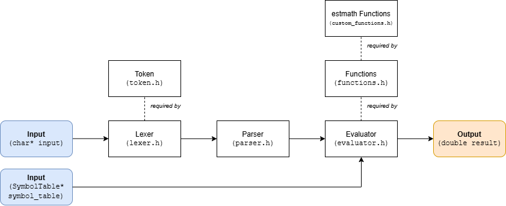

# estmath
Math library for developing electronic calculators made in ESTSetúbal/IPS @ DEE by students.

## Features
- Math expression evaluation using Abstract Syntax Tree (AST) based Parser
- Builtin and user variables support
- Builtin functions (implemented from C99 math.h or custom_math.h)

## Architecture block diagram


## Building
### Requirements
- gcc
- avr-gcc (for building static library on AVR based microcontrollers)

### Compile for desktop (static library + tests)
```
python build.py system
```

### Compile for avr-atmega328p (static library)
```
python build.py avr-atmega328p
```
